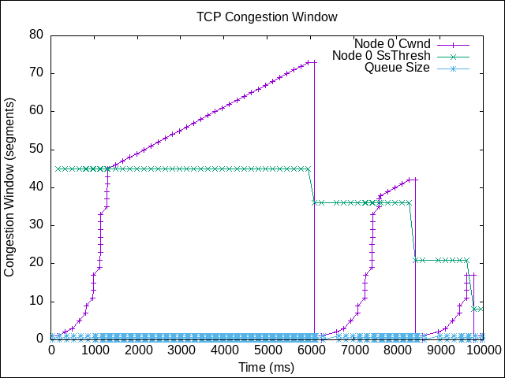
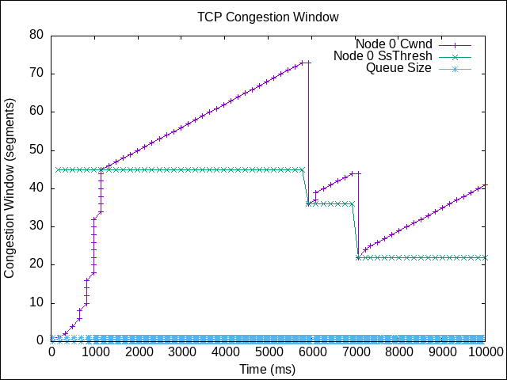
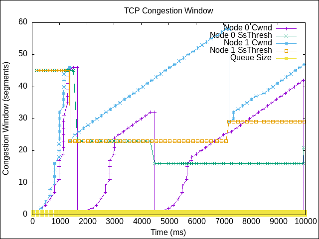
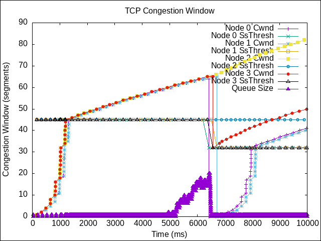

# TCP comparison

This is a comparison between two old TCP variants: TCP Tahoe and TCP Reno, using the ns-3 simulator.

## TCP variants

Over the years, many TCP variants have been developed, each trying to improve the performance of the predecessor, given the right conditions.
Most of them have become highly sophisticated.
Still, it can be interesting to look at two of the first TCP variants: TCP Tahoe and TCP Reno and see the basic components of any TCP variant.

### TCP Tahoe

TCP Tahoe is the first TCP variant to consider the issue of congestion.
It's mechanism is very simple and can be easily understood.
This makes it a good starting point to understand how TCP works.
It uses

- **slow start**: it doubles the congestion window every RTT.
- **congestion avoidance**: it increases the congestion window by 1 every RTT.
- **fast retransmit**: it detects packet loss by checking if the next packet is received.

### TCP Reno

TCP Reno is the first TCP variant to be standardized. It is a newer TCP variant than TCP Tahoe and uses a more complex mechanism to handle congestion.
Apart from the slow start and congestion avoidance mechanisms, it uses:

- **fast recovery**: it recovers from packet loss by halving the congestion window instead of going straight in the slow start phase.

## Installation

### Requirements

- [ns-3 simulator v3.37](https://www.nsnam.org/).
- [c++ compiler](https://gcc.gnu.org/).
- [cmake](https://cmake.org/).
- [python3](https://www.python.org/).

The simulation uses the [ns-3 simulator](https://www.nsnam.org/), and has been developed and tested with the version 3.37.

### Build

First, make sure you have already completed all the step required for the installation of the simulator shown [here](https://www.nsnam.org/docs/release/3.37/tutorial/html/index.html).  
The directory structure should look something like this:

```bash
.
└── ns-allinone-3.37/
    └── ns-3.37/
        ├── ns3
        ├── examples/
        ├── src/
        ├── scratch/
        └── ...
```

Move to the `scratch` folder and clone the repository:

```bash
cd ns-allinone-3.37/ns-3.37/scratch
git clone git@github.com:TendTo/ns3-Tahoe-vs-Reno.git
```

Lastly, move back to the `ns-3.37` folder and build the simulation:

```bash
cd ..
./ns3 run "p2p-project --PrintHelp"
```

## Usage

The simulation is highly configurable. The following options are available:

```bash
Usage: ./ns3 run "p2p-project [options]"

Program Options:
    --n_tcp_tahoe:         Number of Tcp Tahoe nodes [1]
    --n_tcp_reno:          Number of Tcp Reno nodes [1]
    --s_buf_size:          Sender buffer size (bytes) [131072]
    --r_buf_size:          Receiver buffer size (bytes) [131072]
    --cwnd:                Initial congestion window (segments) [1]
    --ssthresh:            Initial slow start threshold (segments) [65535]
    --mtu:                 Size of IP packets to send (bytes) [1500]
    --sack:                Enable SACK [true]
    --nagle:               Enable Nagle algorithm [false]
    --error_p:             Packet error rate [0]
    --s_bandwidth:         Sender link bandwidth [10Mbps]
    --s_delay:             Sender link delay [40ms]
    --r_bandwidth:         Receiver link bandwidth [10Mbps]
    --r_delay:             Receiver link delay [40ms]
    --tcp_queue_size:      TCP queue size (packets) [25]
    --run:                 Run id [0]
    --duration:            Duration of the simulation (s) [3]
    --max_mbytes_to_send:  Maximum number of megabytes to send (MB) [0]
    --prefix_file_name:    Prefix file name [P2P-project]
    --graph_output:        The type of image to output: png, svg [png]
    --ascii_tracing:       Enable ASCII tracing [false]
    --pcap_tracing:        Enable Pcap tracing [false]

General Arguments:
    --PrintGlobals:              Print the list of globals.
    --PrintGroups:               Print the list of groups.
    --PrintGroup=[group]:        Print all TypeIds of group.
    --PrintTypeIds:              Print all TypeIds.
    --PrintAttributes=[typeid]:  Print all attributes of typeid.
    --PrintVersion:              Print the ns-3 version.
    --PrintHelp:                 Print this help message.
```

## Example usages

The following are some example usages of the simulation with the output graphs.

### Scenario 1

```bash
./ns3 run "p2p-project --n_tcp_tahoe=1 --n_tcp_reno=0 --error_p=0.001 --run=0 --duration=10"
```



### Scenario 2

```bash
./ns3 run "p2p-project --n_tcp_tahoe=0 --n_tcp_reno=1 --error_p=0.001 --run=0 --duration=10"
```



### Scenario 3

```bash
./ns3 run "p2p-project --n_tcp_tahoe=1 --n_tcp_reno=1 --error_p=0.002 --run=1 --duration=10"
```



### Scenario 4

```bash
./ns3 run "p2p-project --n_tcp_tahoe=2 --n_tcp_reno=2 --run=0 --duration=10"
```



## Conclusion

TCP Tahoe and TCP Reno are very similar. The main difference is that TCP Reno uses a fast retransmit mechanism to detect packet loss and a fast recovery mechanism to recover from packet loss and follows up with a fast recovery phase.  
This means that, in most cases, TCP Reno outperforms TCP Tahoe.

## References

- [ns-3](https://www.nsnam.org/)
- [TCP congestion control](https://datatracker.ietf.org/doc/html/rfc5681)
- [A Comparative Analysis of TCP Tahoe, Reno, New-Reno, SACK and Vegas](https://inst.eecs.berkeley.edu/~ee122/fa05/projects/Project2/SACKRENEVEGAS.pdf)
